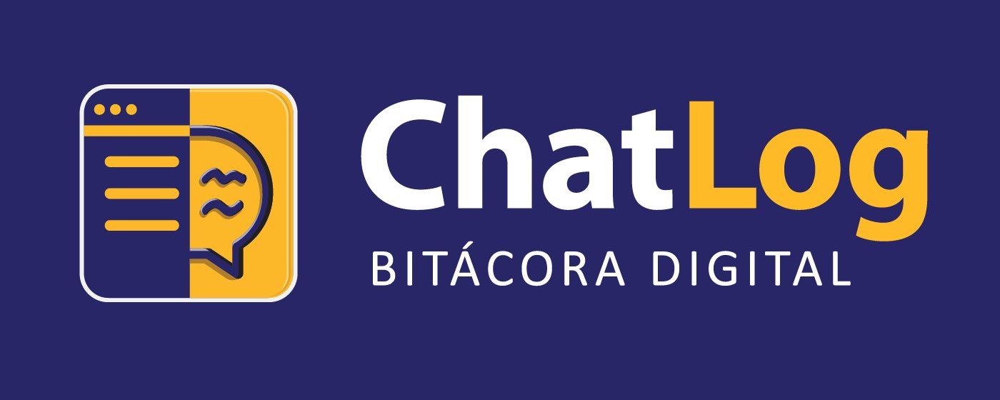

# ChatLog

### Registra. Organiza. Declara.

*Bitácora digital para documentar, con transparencia y trazabilidad, el uso de modelos de lenguaje en el trabajo académico.*

Extensión publicada en Chrome Web Store · Versión 2.0.0

[**▸ Instalar desde Chrome Web Store**](https://chromewebstore.google.com/detail/chatlog/faipejgfejnoaigphcdbdeppgjmdaobn)

---

## Resumen

**ChatLog** es una extensión para Google Chrome diseñada para documentar de manera clara y trazable el uso de modelos de lenguaje en actividades académicas. Su objetivo es ayudar a profesores y estudiantes a registrar cómo utilizaron estas herramientas, con qué finalidad y bajo qué criterios de revisión humana.

A diferencia de un simple historial, ChatLog convierte cada interacción con la IA en un registro estructurado y verificable, que luego puede transformarse en una **declaración de uso** lista para acompañar un trabajo, una tesis o un artículo. La herramienta está pensada para personas no técnicas, con una interfaz guiada y orientada a la práctica universitaria.

## Fundamento conceptual

ChatLog responde a una preocupación creciente en la educación superior: cómo hacer transparente y trazable el uso de la inteligencia artificial sin reducirlo a la prohibición ni a la sospecha. Su diseño se apoya en estándares y marcos internacionales de declaración de uso de IA, en particular el **AID Framework** (Artificial Intelligence Disclosure), junto con las orientaciones del Vancouver Standard y las directrices editoriales de las principales casas académicas.

El principio rector es que **el valor de la herramienta está en la verificación humana y la trazabilidad, no en automatizar el juicio académico**. ChatLog no evalúa ni decide: documenta, organiza y ayuda a declarar, dejando siempre la responsabilidad intelectual en manos de quien la usa.

## Funcionalidades

| Función | Descripción |
|---|---|
| **Proyectos** | Organización del trabajo por actividad, curso, tesis o investigación. |
| **Registro de interacciones** | Documentación de cada uso de IA: finalidad, modelo, proveedor, prompt, etapa del trabajo y verificación humana. |
| **Declaración de uso** | Generación de un texto de declaración a partir de los registros, en distintos formatos. |
| **Revisión de calidad** | Criterios configurables para identificar registros incompletos o que requieren atención. |
| **Estadísticas** | Indicadores de uso por interacciones, modelos, proyectos y finalidades. |
| **Respaldo y transferencia** | Exportación en JSON (estructura completa) y CSV (hoja de cálculo), con importación y recordatorios de respaldo. |

## Privacidad y diseño

ChatLog opera bajo un principio de **privacidad por diseño**:

- **Almacenamiento local.** Los registros, proyectos y configuración residen en el navegador del usuario.
- **Sin recopilación externa.** La extensión está orientada a la documentación personal o de equipo; los datos se comparten únicamente cuando el usuario exporta un respaldo de forma deliberada.
- **Trazabilidad como propósito.** Cada registro conserva la procedencia (modelo, proveedor, prompt, liga de la conversación) y la constancia de la revisión humana.

## Instalación

ChatLog está publicada y disponible para instalación directa:

1. Abrir la [página de ChatLog en Chrome Web Store](https://chromewebstore.google.com/detail/chatlog/faipejgfejnoaigphcdbdeppgjmdaobn).
2. Pulsar **Añadir a Chrome** y confirmar.
3. Fijar el icono en la barra de extensiones para tenerlo a la mano.
4. Abrir el panel lateral y crear el primer proyecto.

> Para un recorrido completo de la herramienta, consulta el *Manual de usuario de ChatLog* (versión 2.0.0).

## Asistentes de apoyo

El proyecto ofrece dos asistentes conversacionales que acompañan el uso de la herramienta y la elaboración de declaraciones de uso de IA:

- **ChatLog asistente** — GPT personalizado que responde dudas sobre el uso de ChatLog.
- **ChatLog copiloto** — asistente personalizado que acompaña el registro y la documentación.

## Contexto

ChatLog es un proyecto académico de acceso abierto desarrollado en el **Departamento de Ciencias Sociales y Políticas** de la Universidad Iberoamericana Ciudad de México (IBERO), con apoyo de la **Dirección de Innovación Educativa (DIE)**. Se inscribe en una línea de trabajo sobre alfabetización, integridad y uso crítico de la inteligencia artificial en contextos académicos.

**Responsable académica:** Dra. Teresa Márquez — teresa.marquez@ibero.mx
**Sitio del proyecto:** https://socialesypoliticas.ibero.mx/chatlog

---

<em>El valor de ChatLog está en la verificación humana y la trazabilidad, no en automatizar el juicio académico.</em>

