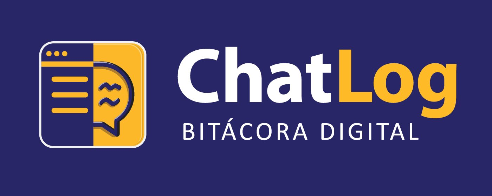

# ChatLog

### Registra. Organiza. Declara.

*Bitácora digital para documentar, con transparencia y trazabilidad, el uso de modelos de lenguaje en el trabajo académico.*

Código fuente y manuales · **Versión 2.0.1 en revisión**

Versión disponible en Chrome Web Store · 2.0.0

[**▸ Instalar desde Chrome Web Store**](https://chromewebstore.google.com/detail/chatlog/faipejgfejnoaigphcdbdeppgjmdaobn)

---

## Resumen

**ChatLog** es una extensión para Google Chrome diseñada para documentar de manera clara y trazable el uso de modelos de lenguaje en actividades académicas. Su objetivo es ayudar a profesores y estudiantes a registrar cómo utilizaron estas herramientas, con qué finalidad y bajo qué criterios de revisión humana.

A diferencia de un simple historial, ChatLog convierte cada interacción con la IA en un registro estructurado y verificable, que luego puede transformarse en una **declaración de uso** lista para acompañar un trabajo, una tesis o un artículo. La herramienta está pensada para personas no técnicas, con una interfaz guiada y orientada a la práctica universitaria.

## Fundamento conceptual

ChatLog responde a una preocupación creciente en la educación superior: cómo hacer transparente y trazable el uso de la inteligencia artificial sin reducirlo a la prohibición ni a la sospecha. Su diseño se apoya en estándares y marcos internacionales de declaración de uso de IA, en particular el **AID Framework** (Artificial Intelligence Disclosure), junto con las orientaciones del Vancouver Standard y las directrices editoriales de las principales casas académicas.

El principio rector es que **el valor de la herramienta está en la verificación humana y la trazabilidad, no en automatizar el juicio académico**. ChatLog no evalúa ni decide: documenta, organiza y ayuda a declarar, dejando siempre la responsabilidad intelectual en manos de quien la usa.

## Funcionalidades

| Función | Descripción |
|---|---|
| **Proyectos** | Organización del trabajo por actividad, curso, tesis o investigación. |
| **Registro de interacciones** | Documentación de cada uso de IA: finalidad, modelo, proveedor, prompt, etapa del trabajo y verificación humana. |
| **Declaración de uso** | Generación de un texto de declaración a partir de los registros, en distintos formatos. |
| **Revisión de calidad** | Criterios configurables para identificar registros incompletos o que requieren atención. |
| **Estadísticas** | Indicadores de uso por interacciones, modelos, proyectos y finalidades. |
| **Respaldo y transferencia** | Exportación en JSON (estructura completa) y CSV (hoja de cálculo), con importación y recordatorios de respaldo. |

## Cambios de la versión 2.0.1

- **Guardado automático.** Conserva registros y borradores mientras escribes, muestra el estado del guardado y recupera el formulario al reabrir el panel. «Nuevo registro» inicia otra interacción conservando la anterior.
- **Evidencia web, local o en la nube.** Puedes registrar un enlace de conversación o el nombre y ubicación de un archivo de evidencia, también para interacciones en aplicaciones de escritorio. El campo admite URL de Google Drive o OneDrive. Los archivos se conservan y respaldan por separado; ChatLog guarda su referencia y no comprueba sus permisos de acceso.
- **Declaraciones con versión.** El aviso de las declaraciones estándar y detalladas identifica la versión de ChatLog utilizada.
- **Captura más sencilla.** El nombre de nuevo proyecto se oculta al seleccionar uno existente. «Crear proyecto» vuelve a mostrarlo. Las listas de Empresa proveedora y Nombre del LLM permiten cambiar la selección sin borrar el texto y completan su par en ambos sentidos. También admiten otros nombres.
- **Ayudas y estadísticas.** Los botones explican su función al pasar el mouse o enfocarlos con el teclado. JSON sirve para restaurar ChatLog; CSV permite revisar registros en una hoja de cálculo. Los encabezados de Estadísticas cubren las filas al desplazarse.

- **Apertura y organización del código.** La carga inicial agrupa la lectura de datos; Declaración, Estadísticas y Herramientas se cargan al seleccionarlas. Las fichas y los detalles de los registros se construyen cuando se abren.
- **Recuperación de apertura.** Si falla la carga inicial, el aviso permanece visible y permite «Reintentar» sin cerrar el panel ni duplicar los eventos de los controles.
- **Versión en respaldos.** Los JSON indican la versión instalada de ChatLog; la vista previa la distingue de la versión del formato. Los respaldos anteriores siguen siendo compatibles.

La 2.0.1 está disponible aquí para revisión. Actualizar este repositorio no publica la extensión en Chrome Web Store.

## Privacidad y diseño

ChatLog opera bajo un principio de **privacidad por diseño**:

- **Almacenamiento local.** Los registros, proyectos y configuración residen en el navegador del usuario.
- **Sin recopilación externa.** La extensión está orientada a la documentación personal o de equipo; los datos se comparten únicamente cuando el usuario exporta un respaldo de forma deliberada.
- **Trazabilidad como propósito.** Cada registro conserva la procedencia (modelo, proveedor, prompt, enlace de la conversación o referencia de evidencia conservada) y la constancia de la revisión humana.

## Instalación

ChatLog está publicada y disponible para instalación directa:

1. Abrir la [página de ChatLog en Chrome Web Store](https://chromewebstore.google.com/detail/chatlog/faipejgfejnoaigphcdbdeppgjmdaobn).
2. Pulsar **Añadir a Chrome** y confirmar.
3. Fijar el icono en la barra de extensiones para tenerlo a la mano.
4. Abrir el panel lateral y crear el primer proyecto.

> Consulta el [Manual de usuario de ChatLog 2.0.1 en PDF](manuals/Manual_Usuario_ChatLog_v2.0.1.pdf) o su [versión editable en Word](manuals/Manual_Usuario_ChatLog_v2.0.1.docx).

### Revisión de la versión 2.0.1

Descarga o clona el repositorio. En `chrome://extensions`, activa el modo desarrollador, pulsa «Cargar descomprimida» y selecciona la carpeta que contiene `manifest.json`. Una instalación de desarrollo tiene almacenamiento independiente de la extensión de la tienda; conserva un respaldo JSON de tus registros antes de probar.

Para revisar la interfaz local, ejecuta `python3 tools/preview.py` y abre `http://127.0.0.1:8765/panel/index.html`. Esta vista tiene su propio almacenamiento y no sustituye la prueba final de la extensión instalada.

- [Guía de revisión de la versión 2.0.1](REVISION_2.0.1.md)
- [Instalación y prueba desde la barra de Chrome](PRUEBA_2.0.1.md)
- [Política de privacidad](https://tmarquez-mx.github.io/ChatLog/privacidad/)
- [Analíticas de distribución y reportes](ANALITICAS.md)

### Evidencia de interacciones en aplicaciones de escritorio

Completa el mismo formato de ChatLog y elige «Archivo de evidencia conservada» en «Referencia de la interacción». La evidencia puede ser una exportación en PDF o texto, una transcripción o capturas legibles del intercambio. Incluye las instrucciones, respuestas relevantes, fecha, aplicación y datos del modelo cuando estén disponibles; identifica los extractos y documenta la revisión humana. La evidencia permite revisar el intercambio, pero no demuestra por sí misma que las respuestas sean correctas.

Guarda la copia en la carpeta del proyecto, por ejemplo `Evidencias/2026-10-01_revision-pregunta.pdf`, y escribe esa referencia en «Nombre y ubicación del archivo». También puedes indicar una URL de Google Drive o OneDrive y verificar por separado que las personas destinatarias tengan acceso. Respalda los archivos por separado: las exportaciones JSON y CSV no los incluyen. El manual explica cómo recoger y conservar la evidencia.

### Comprobación del código

Ejecuta `npm test`: la revisión actual pasa 48 pruebas de guardado, recuperación, errores y reintentos, compatibilidad de datos, referencias de evidencia y carga real de módulos. Las pruebas utilizan datos ficticios y almacenamiento simulado.

`python3 tools/package_extension.py --check` valida los 20 archivos necesarios y sus dependencias sin generar el ZIP. Sin `--check`, crea el paquete y la carpeta descomprimida en `dist/`, con manual y política incluidos. El manifiesto mantiene 2.0.1, requiere Chrome 116 como mínimo y conserva los permisos `storage`, `sidePanel` y `downloads`.

La entrada está en [`script.js`](script.js). [`modules/`](modules/) separa almacenamiento, reglas de registros, declaraciones, estadísticas, administración y transferencia. Los módulos secundarios se cargan al seleccionarlos. Consulta el [informe de eficiencia](auditoria/Auditoria_eficiencia_2.0.1.txt) y el [informe de correcciones](auditoria/Auditoria_ChatLog_2.0.1.txt). La apertura completa desde el icono todavía debe comprobarse con la copia instalada en Chrome.

## Asistentes de apoyo

El proyecto ofrece dos asistentes conversacionales que acompañan el uso de la herramienta y la elaboración de declaraciones de uso de IA:

- **ChatLog asistente** — GPT personalizado que responde dudas sobre el uso de ChatLog.
- **ChatLog copiloto** — asistente personalizado que acompaña el registro y la documentación.

## Contexto

ChatLog es un proyecto académico de acceso abierto desarrollado en el **Departamento de Ciencias Sociales y Políticas** de la Universidad Iberoamericana Ciudad de México (IBERO), con apoyo de la **Dirección de Innovación Educativa (DIE)**. Se inscribe en una línea de trabajo sobre alfabetización, integridad y uso crítico de la inteligencia artificial en contextos académicos.

**Responsable académica:** Dra. Teresa Márquez — teresa.marquez@ibero.mx
**Sitio del proyecto:** https://socialesypoliticas.ibero.mx/chatlog

El [registro histórico en Zenodo](https://doi.org/10.5281/zenodo.21168851) corresponde a la versión 2.0 de junio de 2026.

---

<em>El valor de ChatLog está en la verificación humana y la trazabilidad, no en automatizar el juicio académico.</em>

